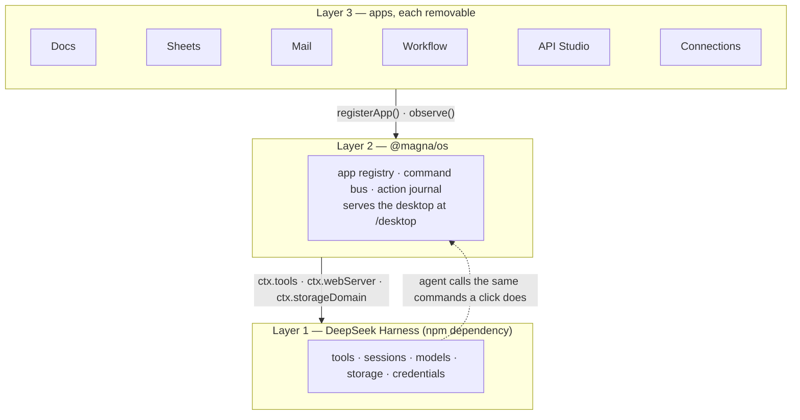
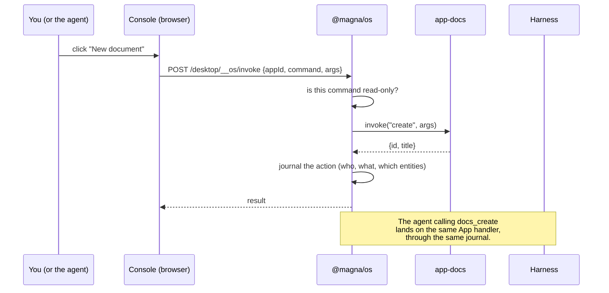
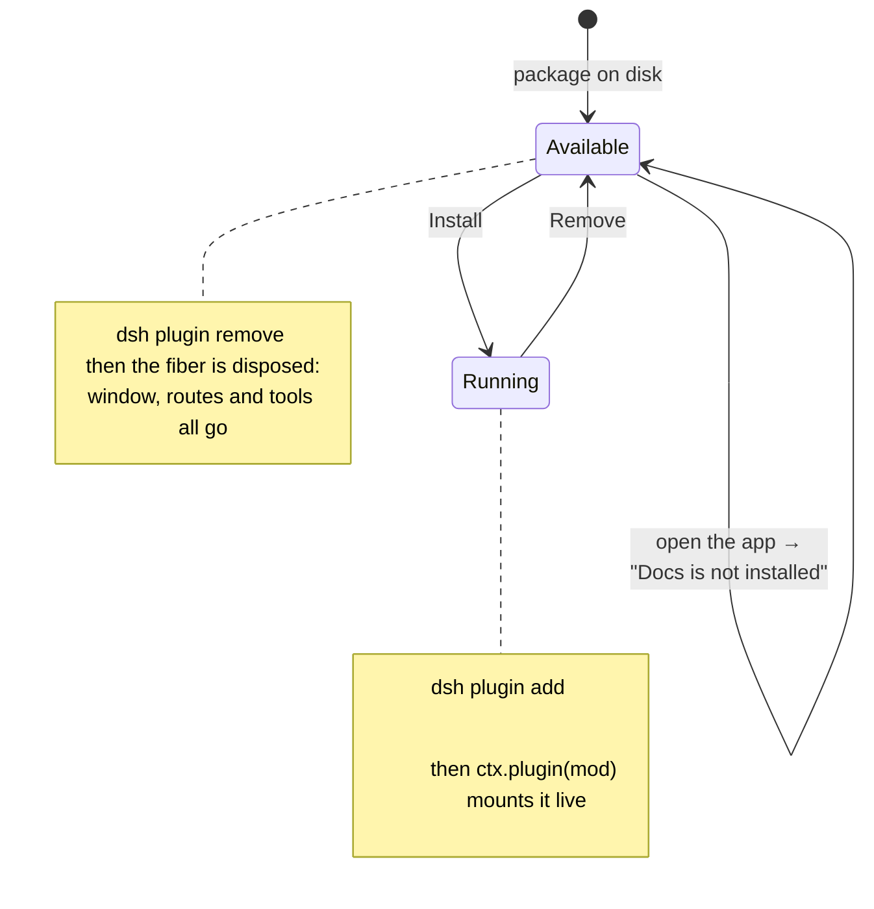

# MagnaVERSE

A sovereign AI desktop that runs on your own hardware. Documents, spreadsheets, mail,
workflows and an API client — every one of them a plugin the agent can drive, on top of
the [DeepSeek Harness](https://github.com/deepseek-ai/deepseek-harness).

The unusual part is the direction. Most AI desktops put a chat window beside your apps.
This puts the harness *underneath* them, so the agent sees every app, every action and
every document through one bus — and so anything the agent can do, you can do, and both
leave the same trace.



**An app plugin reaches the OS and nothing else.** It cannot touch `ctx.tools` or
`ctx.webServer` directly. That boundary is what makes apps replaceable and their
activity attributable — the OS stamps which app did what, so a marketplace plugin
cannot log an action in another app's name.

---

## Repository layout

| Path | What it is |
|---|---|
| **`packages/os/`** | **Layer 2.** The MagnaVERSE OS — one Cordis plugin. Owns the app registry, the command bus, the action journal, and the HTTP routes under `/desktop`. |
| **`packages/app-*/`** | **Layer 3.** Thirteen app plugins. Each has a `lib/` host half and a `client/` browser half. Install and remove them at runtime. |
| **`apps/`** | The Console — the desktop UI itself (`app-7-console.html`), plus standalone app mockups. Served by the OS at `/desktop/console/`. |
| **`docs/`** | Every design deliverable, brief and research note. Start at [`docs/system-status.html`](docs/system-status.html). |
| **`scripts/`** | `link-harness.sh` — links the harness's own modules into each package (see [Why the link script exists](#why-the-link-script-exists)). |
| **`vendor/` `assets/`** | Self-hosted third-party code (Monaco, MIT) and static assets. Nothing loads from a CDN. |
| `index.html` | The deliverables gallery. |

**The harness itself is not in this repo.** `@deepseek-ai/dsh` is an npm dependency,
installed globally and run as `dsh web`. This repository is the two layers above it.

---

## Running it

You need Node 20+ and [Ollama](https://ollama.com) if you want a local model.

```bash
# 1. Install the harness
npm install -g @deepseek-ai/dsh

# 2. Register the OS as a profile layer (once)
dsh plugin --profile web add ./packages/os

# 3. Link the harness's own modules into each package (see below — this is required)
bash scripts/link-harness.sh

# 4. Install the apps you want
for p in docs sheets mail workflow api connections brain market \
         approvals ledger models terminal trajectory; do
  dsh plugin --profile web add ./packages/app-$p
done

# 5. Run
dsh web
```

Then open **http://127.0.0.1:3080/desktop/**.

### Why the link script exists

`dsh plugin add ./packages/os` installs a local directory with pnpm's `link:` protocol.
The package therefore stays where it is in this repo, and Node resolves its imports by
walking up from *here* — it never reaches the profile's module farm at
`$DSH_HOME/profiles/node_modules`.

`scripts/link-harness.sh` bridges that gap by symlinking the harness's own copies in.
Linking rather than installing a second copy is deliberate: **two copies of Cordis would
mean two `Service` base classes**, and a service registered against one would be
invisible to code holding the other.

Re-run it after adding a package or reinstalling dsh.

---

## How a request flows

The same path for a human click and for the agent. That is the point.



Read-only commands (`list`, `read`, `search`) are deliberately **not** journalled. An
earlier build learned this the hard way: the Brain app filled 492 of 500 journal entries
by polling its own data — it was writing to the journal by reading it.

---

## Installing and removing a plugin at runtime

No restart. The OS owns its apps' fibers, so disposing one takes its window, its assets
and its agent tools with it.



**Two forms, one target.** `add` wants the *directory* (that is what it links to);
`remove` wants the *package name* and fails outright on a path. The OS resolves both,
because the browser only ever knows directories.

---

## Writing an app plugin

An app is a manifest, a command handler, a browser half, and some tools.
`packages/app-docs/` is the smallest complete example. The host half:

```js
export const name = "magna-app-notes";
export const inject = ["magnaOS", "tools"];   // magnaOS is the only layer-2 dependency

export function apply(ctx) {
  const os = ctx.magnaOS;

  async function invoke(command, args) {      // one handler, every entry point
    switch (command) {
      case "list":   return { notes: [...] };
      case "create": return { id: "…" };
      default: throw new Error('notes: unknown command "' + command + '"');
    }
  }

  const dispose = os.registerApp({
    id: "notes", name: "Notes", pkg: "@magna/app-notes",
    permissions: { grant: ["notes:read"], deny: ["net:egress"] },
    contributes: {
      tools: ["notes_search"],
      commands: ["list", "create"],
      readOnly: ["list"],                     // polling these must not fill the journal
    },
    clientRoot: resolve(HERE, "..", "client"),
  }, invoke);

  const scope = dispose.scope;                // stamps appId itself — unforgeable
}
```

Three rules learned by breaking them:

1. **Never assign `root.className`** in the browser half. That element is the Console's
   own window body, and its class is what positions it below the title bar. Style by the
   `data-mv-app` attribute the OS stamps there.
2. **Scope your CSS.** The Console owns short prefixes like `.br-*` and `.sh-*`. An
   unscoped collision silently restyles the desktop.
3. **Use custom properties that exist.** The Console defines `--glass-*` and `--tx-*`,
   not `--surface`. An undefined custom property invalidates the whole declaration — one
   wrong name once erased every border across nine plugins at a stroke.

Full guide: [`docs/plugin-architecture.html`](docs/plugin-architecture.html).

---

## What is real, and what is not

This project has a rule: **a screen shows what the system can actually observe, and
where it cannot observe something it says so** rather than rounding to the comfortable
answer.

- **Real:** Workflow executes against the live tool registry with an approval gate on
  every write; Mail speaks IMAP and Microsoft Graph; API Studio sends real requests;
  Connections verifies GitHub, GitLab and Atlassian against the live services.
- **Not real yet:** fourteen Console screens are still built-in mockups — Agents,
  Automations, Chat, Database, Memory and others.

[`docs/system-status.html`](docs/system-status.html) is the honest inventory, generated
from the running build, with the evidence beside each claim and the remaining work in
priority order.

---

## Licence

MIT. Third-party code is MIT-only and self-hosted — Monaco is vendored under `vendor/`
rather than loaded from a CDN, because the Sovereignty widget claims nothing leaves the
machine and a CDN script tag would make that false.
